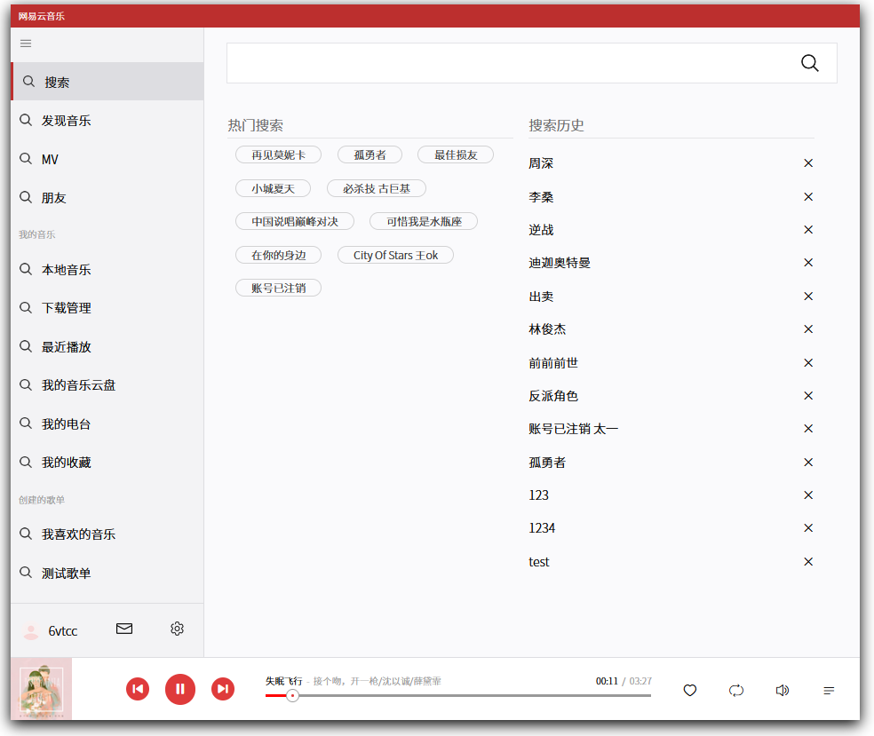

## 🎵 网易云 UWP 版客户端仿写

🚀 基于大佬的网易云后端 api 实现功能

🤖[后端地址在这里 👈](https://github.com/Binaryify/NeteaseCloudMusicApi)

### 实现功能

- 登录注册
- 保留登录状态
- 搜索歌曲、搜索历史保留
- 发现音乐主界面
- 获取并展示你所拥有的歌单
- 音乐播放器
- 播放历史保留
##### 其余功能待完善...

### 界面展示


## 使用

1. 安装

   ```
   yarn
   ```

2. 启动
   ```
   yarn serve
   ```
